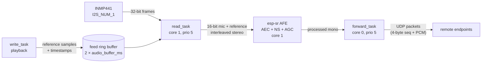
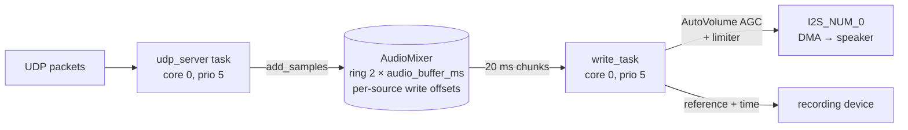

# Audio pipeline overview

This document describes how audio actually flows through the firmware, as implemented today.
It is the reference for the findings in [findings.md](findings.md).

## Hardware

- **Microphone**: INMP441 MEMS mic (24-bit samples in a 32-bit I2S frame), on `I2S_NUM_1`,
  mono, left slot.
- **Speaker**: I2S amplifier (MAX98357-class) on `I2S_NUM_0`, 16-bit mono,
  MSB/left-justified slot format.
- **Sample rate**: 16 kHz everywhere (enforced by a compile-time check in `support.h`).
- **Transport**: raw PCM over UDP on port 11106, 4-byte big-endian packet counter header,
  no compression. 16 kHz × 16 bit mono ≈ 256 kbit/s per stream plus UDP/IP overhead —
  fine on a LAN.

## Record path (mic → network)

1. `read_task` (`I2SRecordingDevice.cpp`) blocks on `i2s_channel_read()`, one AFE feed
   chunk at a time. Each raw 32-bit frame is shifted into a 16-bit sample:
   `(sample << 1) >> (16 - microphone_gain_bits)`. With the default
   `microphone_gain_bits = 3` this keeps the top 19 bits of the 24-bit mic range and
   clamps to `int16` (see finding Q1 on clipping).
2. An optional per-sample "auto volume" (`scale_sample`) compresses peaks above
   full-scale down into 16 bits. Disabled by default.
3. The mic samples are interleaved with **reference samples** (what the speaker is
   currently playing) into a stereo buffer and fed to the esp-sr AFE, configured as
   `"MR"` (one mic + one reference) with:
   - AEC (echo cancellation) in `AEC_MODE_VOIP_HIGH_PERF`, filter length 4
   - NS (noise suppression) enabled
   - AGC (WebRTC) enabled, target −3 dBFS, 9 dB compression gain
   - VAD and WakeNet disabled
4. `forward_task` fetches processed audio from the AFE and hands it to
   `Device::send_audio()`, which prefixes a 4-byte packet counter and sends it via UDP
   to every registered endpoint.
5. When `enable_audio_processing` is false, the AFE is bypassed: the interleaving
   loop emits mic samples only and `send_audio` is called directly from `read_task`.

### AEC reference timing

This is the subtlest part of the design and it is fundamentally sound:

- `write_task` computes the wall-clock time (`esp_timer`) at which each playback chunk
  will actually come out of the DAC (channel-enable time + preloaded samples), and pushes
  the post-volume samples plus that timestamp into a ring buffer
  (`feed_reference_samples`).
- `read_task` anchors its own wall-clock time at `i2s_channel_enable()` and advances it
  by exact sample counts. On every chunk it aligns the head of the reference ring buffer
  with the current recording time (skipping stale samples) and interleaves the matching
  reference samples; zeros when nothing is playing.
- Both I2S peripherals derive their clocks from the same PLL, so record and playback
  cannot drift relative to each other. The wall-clock anchors are only used to establish
  the initial offset, which the AEC's adaptive filter then absorbs.

## Playback path (network → speaker)

1. Any UDP packet arriving on port 11106 starts playback if not already playing, then is
   appended to the `AudioMixer`.
2. The mixer is a zero-initialized ring buffer of `2 × audio_buffer_ms` (default 2 × 200 ms).
   Each source (IP:port) gets its own write offset. A **new** source starts writing
   `audio_buffer_ms` (200 ms) ahead of the read position — this lead is the jitter buffer.
   Multiple simultaneous sources are summed with clamping ("party line" mixing).
3. The 4-byte packet counter is only used to drop stale/duplicate packets
   (`index < last seen`). Packets are otherwise appended back-to-back at the source's
   write offset — sequence gaps are *not* reconstructed (finding H2).
4. `write_task` preloads the I2S DMA buffers with silence (~90 ms at defaults), enables
   the channel, then pulls 20 ms chunks (`CONFIG_DEVICE_AUDIO_CHUNK_MS`) from the mixer,
   paced by the blocking `i2s_channel_write()`.
5. Each chunk passes through `AutoVolume` (when enabled): block RMS detector → soft-knee
   downward gain toward `playback_target_db` (default −14 dBFS) with attack/hold/release,
   plus the static volume offset (−30…−8 dB mapped from the 0–1 volume) and a hard
   limiter at −0.1 dBFS. The processed chunk is also fed to the recording device as the
   AEC reference.
6. When the mixer runs dry (every source's write offset has fallen behind the read
   offset) playback stops entirely; the next packet restarts it from scratch, including
   the DMA silence preload and the 200 ms jitter lead (finding H3).

## Latency budget (defaults)

| Stage | Approx. |
|---|---|
| Sender: AFE chunk aggregation | 15–35 ms |
| Network (LAN) | 1–5 ms |
| Jitter-buffer lead (`audio_buffer_ms`) | 200 ms |
| DMA silence preload (6 desc × 240 frames) | ~90 ms |
| Playback chunk | 20 ms |
| **Total mouth-to-ear** | **~330–350 ms** |

Acceptable for announcements/door-intercom use; on the high side for a two-way
conversation. See finding L6 for where it can be reclaimed.

## Tasks and cores

| Task | Core | Prio | Role |
|---|---|---|---|
| `read_task` | 1 | 5 | I2S mic read, scaling, AFE feed |
| AFE internal task | 1 | esp-sr default | AEC/NS/AGC processing |
| MQTT | 1 | — | `CONFIG_MQTT_USE_CORE_1` |
| `forward_task` | 0 | 5 | AFE fetch → UDP send |
| `write_task` | 0 | 5 | mixer → AutoVolume → I2S |
| `udp_server` | 0 | 5 | recvfrom → mixer append |
| WiFi | 0 | 23 | ESP-IDF stack |
| lwIP | any | 18 | ESP-IDF stack |

Audio buffers are all allocated with `MALLOC_CAP_INTERNAL`, which is the right call given
that instruction/rodata and WiFi/lwIP buffers live in PSRAM.

## Runtime configuration

`AudioConfiguration` is delivered over MQTT (`audio_config` topic), persisted to NVS, and
applied after a restart. Defaults (from `Device::load_state()`):

| Setting | Default | Meaning |
|---|---|---|
| `volume_scale_low/high` | −30 / −8 dB | volume-knob → static gain offset mapping |
| `enable_audio_processing` | true | AFE (AEC+NS+AGC) on record path |
| `audio_buffer_ms` | 200 | jitter-buffer lead; mixer ring is 2× this |
| `microphone_gain_bits` | 3 | extra headroom bits kept above 16 (see Q1) |
| `recording_auto_volume_enabled` | false | per-sample peak compressor on mic |
| `recording_smoothing_factor` | 0.1 | its per-sample decay (see Q2) |
| `playback_auto_volume_enabled` | true | AutoVolume AGC on speaker path |
| `playback_target_db` | −14 dBFS | AGC target |
